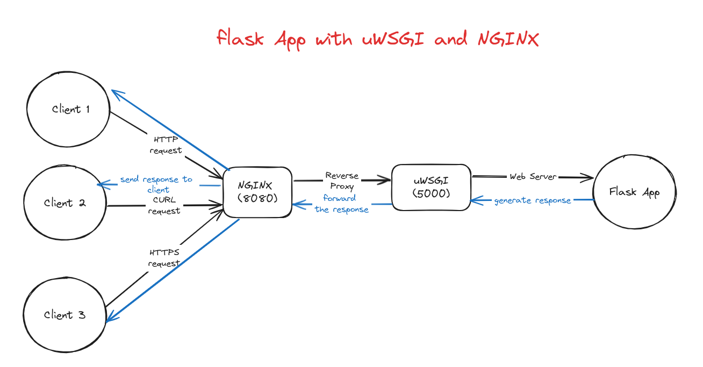

# Flask Application with NGINX and uWSGI


## Introduction 
This document describes the implementation and the architecture of a web application built with the Flask framework running behind a reverse proxy server (NGINX) and a web server gateway interface (WSGI) server (uWSGI). This architecture provides several benefits, including scalability, security, performance, and load balancing.

The following sections will detail the components involved, the typical request flow from client to application, and the advantages of this architectural approach.

## Architecture



### Components

* **Client:** This is the user or application that interacts with the web application. It can be a web browser, mobile device, or another software application.
 
* **NGINX:** NGINX is a reverse proxy server that sits in front of the web server (uWSGI) and the Flask application. It acts as a load balancer, distributing traffic among multiple web servers and improving the application's performance and scalability. NGINX can also handle SSL/TLS encryption and decryption, improve security.

* **uWSGI:** uWSGI is a web server gateway interface (WSGI) server. It translates requests from the reverse proxy server (NGINX) into a format that the Flask application can understand and vice versa.
 
* **Flask application:** This is the Python web application built with the Flask framework. It handles the application logic, such as processing user input, interacting with databases, and generating responses.

### Scenario

**1.Client sends a request:** The client (web browser, mobile device, etc.) initiates a request to the web application by entering a URL in the address bar or clicking on a link. The request includes information about the requested resource, such as the path, headers, and any data being sent to the server (e.g., form data).

**2.Request reaches NGINX:** The request is routed to the NGINX server.

**3.NGINX distributes request:** NGINX can handle multiple web servers running the Flask application. It distributes the request to an available uWSGI web server.

**4.uWSGI translates request:** The uWSGI server receives the request from NGINX and translates it into a format that the Flask application can understand (WSGI).

**5.uWSGI forwards request to Flask:** uWSGI forwards the translated request to the Flask application.

**6.Flask application processes request:** The Flask application processes the request, which may involve interacting with a database, performing calculations, or generating content.

**7.Flask generates response:** The Flask application generates a response that includes the requested data (e.g., HTML content, JSON data) and an HTTP status code (e.g., 200 OK, 404 Not Found).

**8.Flask sends response to uWSGI:** The Flask application sends the response back to the uWSGI server.

**9.uWSGI translates response:** uWSGI translates the response back into a format that NGINX can understand (usually HTTP).

**10.uWSGI sends response to NGINX:** uWSGI forwards the translated response to NGINX.

**11.NGINX sends response to client:** NGINX sends the response back to the client.

**12.Client receives response:** The client receives the response from NGINX and displays it to the user (e.g., renders an HTML page in the web browser).

### Benefits of this architecture

* **Scalability:** NGINX can distribute traffic among multiple web servers, which allows the application to handle a high volume of traffic.

* **Security:** NGINX can handle SSL/TLS encryption and decryption, which helps to protect sensitive data transmissions between the client and the server.

* **Performance:** NGINX can cache static content, such as images and CSS files, which can improve the application's performance.

* **Load balancing:** NGINX can distribute traffic among multiple web servers, which helps to improve the application's responsiveness.

## Implementation

### uWSGI

1- Add uwsgi uwsgi-python3 alpine packages in Dokerfile
```yml
RUN apk add uwsgi uwsgi-python3
```
2- Add uWSGI python package in requirements.txt
```
uWSGI==2.0.25.1
```

3- Add uWsgi run app command in entrypoint.sh
```shell
uwsgi --http 0.0.0.0:5000  --wsgi-file /app/app.py --callable app
```

4- Run entrypoint.sh in docker-compose service command
```yml
version: '3.5'
services:
  pc-builder-app:
    container_name: pc-builder-app
    ...
    command: sh -c "chmod +x ./entrypoint.sh && ./entrypoint.sh"
```

5- uWSGI + Flask app logs
```log
2024-05-26 14:16:06,188 INFO [PcBuilderApp] 58 Components retrieved successfully
[pid: 8|app: 0|req: 7/7] 172.22.0.5 () {64 vars in 1305 bytes} [Sun May 26 14:16:06 2024] GET /pc-builder-app/main => generated 11710 bytes in 10 msecs (HTTP/1.0 200) 2 headers in 82 bytes (1 switches on core 0)
[pid: 8|app: 0|req: 8/8] 172.22.0.5 () {62 vars in 1239 bytes} [Sun May 26 14:16:06 2024] GET /pc-builder-app/static/css/base.css => generated 0 bytes in 2 msecs (HTTP/1.0 304) 4 headers in 182 bytes (0 switches on core 0)
[pid: 8|app: 0|req: 9/9] 172.22.0.5 () {62 vars in 1220 bytes} [Sun May 26 14:16:06 2024] GET /pc-builder-app/static/js/main.js => generated 0 bytes in 1 msecs (HTTP/1.0 304) 4 headers in 181 bytes (0 switches on core 0)
[pid: 8|app: 0|req: 10/10] 172.22.0.5 () {62 vars in 1239 bytes} [Sun May 26 14:16:06 2024] GET /pc-builder-app/static/css/main.css => generated 0 bytes in 1 msecs (HTTP/1.0 304) 4 headers in 183 bytes (0 switches on core 0)
[pid: 8|app: 0|req: 11/11] 172.22.0.5 () {62 vars in 1309 bytes} [Sun May 26 14:16:06 2024] GET /pc-builder-app/static/images/ccmainbanner-1.jpg => generated 0 bytes in 2 msecs (HTTP/1.0 304) 4 headers in 191 bytes (0 switches on core 0)
```

### Nginx

1- Add nginx docker service 
```yml
version: '3.5'
services:
  ...
  nginx:
    image: nginx:latest
    container_name: nginx
    ports:
      - "8080:80"
    volumes:
      - ./nginx/nginx.conf:/etc/nginx/nginx.conf
      - ./nginx/conf.d:/etc/nginx/conf.d
```

2- Add nginx reverse proxy config in /etc/nginx/conf.d/default.conf

```nginx
server {
    listen       80;
    listen  [::]:80;
    server_name  localhost;
    location / {
        proxy_pass http://pc-builder-app:5000;
        proxy_set_header Host $host;
        proxy_set_header X-Real-IP $remote_addr;
        proxy_set_header X-Forwarded-For $proxy_add_x_forwarded_for;
        proxy_set_header X-Forwarded-Proto $scheme;
    }
    error_page   500 502 503 504  /50x.html;
    location = /50x.html {
        root   /usr/share/nginx/html;
    }
}
```
3- nginx logs
```log
172.22.0.1 - admin [26/May/2024:12:35:43 +0000] "GET /pc-builder-app/table HTTP/1.1" 200 18643 "http://localhost:8080/pc-builder-app/main" "Mozilla/5.0 (X11; Linux x86_64) AppleWebKit/537.36 (KHTML, like Gecko) Chrome/124.0.0.0 Safari/537.36" "-"
172.22.0.1 - admin [26/May/2024:12:35:43 +0000] "GET /pc-builder-app/static/css/base.css HTTP/1.1" 304 0 "http://localhost:8080/pc-builder-app/table" "Mozilla/5.0 (X11; Linux x86_64) AppleWebKit/537.36 (KHTML, like Gecko) Chrome/124.0.0.0 Safari/537.36" "-"
172.22.0.1 - admin [26/May/2024:12:35:43 +0000] "GET /pc-builder-app/static/css/table.css HTTP/1.1" 304 0 "http://localhost:8080/pc-builder-app/table" "Mozilla/5.0 (X11; Linux x86_64) AppleWebKit/537.36 (KHTML, like Gecko) Chrome/124.0.0.0 Safari/537.36" "-"
172.22.0.1 - admin [26/May/2024:12:35:43 +0000] "GET /pc-builder-app/static/js/table.js HTTP/1.1" 304 0 "http://localhost:8080/pc-builder-app/table" "Mozilla/5.0 (X11; Linux x86_64) AppleWebKit/537.36 (KHTML, like Gecko) Chrome/124.0.0.0 Safari/537.36" "-"
172.22.0.1 - admin [26/May/2024:12:35:43 +0000] "GET /pc-builder-app/static/images/ccmainbanner-1.jpg HTTP/1.1" 304 0 "http://localhost:8080/pc-builder-app/table" "Mozilla/5.0 (X11; Linux x86_64) AppleWebKit/537.36 (KHTML, like Gecko) Chrome/124.0.0.0 Safari/537.36" "-"
```